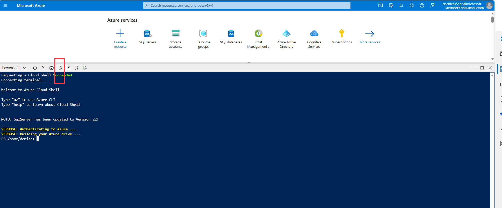

For this workshop you MUST have the following:

## Requirements
- VsCode
- Python (tested with 3.12.2)
- A virtual environment tool (venv)
- An Azure account 
- A subscription onboarded into Azure OpenAI

## Preparation

### VsCode
* Install [Visual Studio Code](https://code.visualstudio.com/)

### Python
* Install [Python 3.12.2](https://www.python.org/downloads/release/python-3122/)

### Python3 Virtualenv Setup
*  Installation
        To install virtualenv via pip run:
            $ pip3 install virtualenv
* Creation of virtualenv:
    - Windows
    $ python -m virtualenv venv (in the openAI workshop directory)
    - Mac
    $ virtualenv -p python3 <desired-path>

    Activate the virtualenv:
    $ source <desired-path>/bin/activate

    Deactivate the virtualenv:
    $ deactivate

### Install all libraries in your virtual environment
* Activate the environment
    Windows:
        .\venv\Scripts\activate.ps1
    Mac:
    $ source ./venv/bin/activate

* Make sure you have the requirements installed in your Python environment using `pip install -r requirements.txt`.


### Create the necessary Azure resources
* Insert your subscription ID in the file [createAll.ps1](./scripts/createAll.ps1) and save it. 
    ```
    $SubscriptionId = "<your subscription here>"
    ```
* Modify the password of the admin user of the SQL database the file [deployAll.bicep](./scripts/deployAll.bicep) and save it. 
    ```
    param adminPassword string = 'ChangeYourAdminPassword1'
    ```
* This powershell script will create:
    * A resource group with name starting with 'openai-workshop'
    * An Azure SQL server with an AdventureWorks sample database
    * An AI Search service
    * An AI Speech service
    * An Azure OpenAI service with the following models:
        * GPT-3.5
        * GPT-4
        * GPT-4 Vision
        * DALL-E
        * Text Embedding Ada


* Go to the azure portal and login with a user that has permissions to create resource groups and resources in your subscription
* Open the cloud shell in the azure portal as follows:


* Upload the files in the scripts folder: "createAll.ps1" and "deployAll.bicep" ONE BY ONE by using the upload file button in the cloud shell


* Run ./createAll.ps1

NOTE: This takes time so be patient
You should get a resource group with the following resources


# IMPORTANT!
### Setup environment variables
* Rename the '.env.template' file to '.env' and modify all the endpoints and api keys for all deployments as follows:
```
# Open AI details
OPENAI_GPT35_DEPLOYMENT_NAME="gpt-35-turbo-16k"
OPENAI_GPT4_DEPLOYMENT_NAME="gpt-4"
OPENAI_GPT4V_DEPLOYMENT_NAME="gpt-v"
OPENAI_ADA_EMBEDDING_DEPLOYMENT_NAME="text-embedding-ada-002"
OPENAI_DALLE_DEPLOYMENT_NAME="dall-e-3"

OPENAI_DEPLOYMENT_ENDPOINT="<your azure openai deployment url>" 
OPENAI_API_KEY="<the key to the azure open ai service>"

# SQL Server details
SQL_USER="SqlAdmin"
SQL_DBNAME="aworks"

SQL_SERVER="<your sql server url>"
SQL_PWD="<the password you defined in the bicep file>"


# AI Speech details
SPEECH_REGION="westeurope"

SPEECH_KEY="<the key for the speech service>"

# AI Search details
AZURE_SEARCH_SERVICE_ENDPOINT="<your azure ai search deployment url>"
AZURE_SEARCH_ADMIN_KEY="<the management key of the ai search>"
```